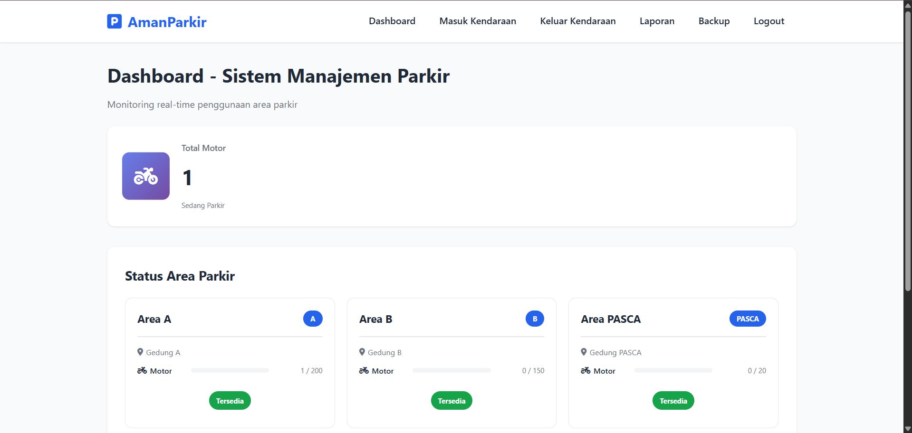
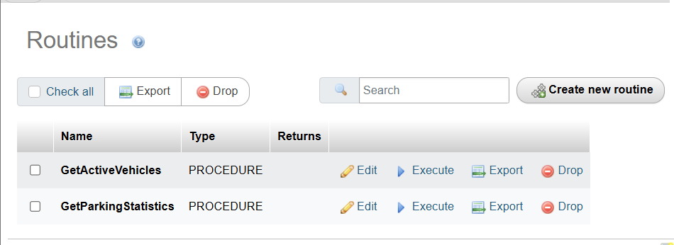
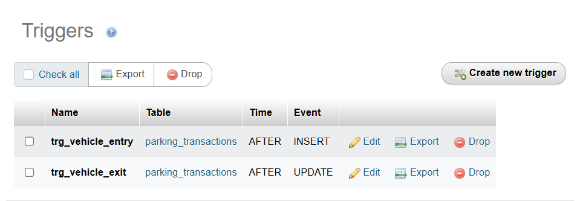
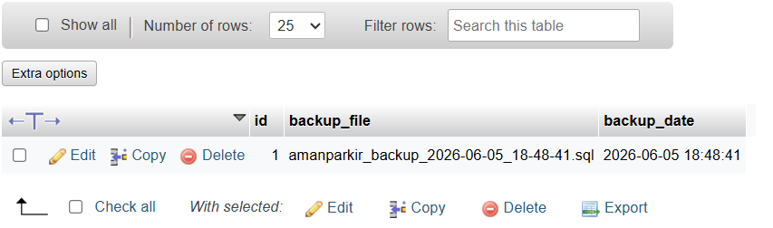

# 🏍️ AmanParkir (Proyek UAP)

Proyek ini merupakan sistem manajemen parkir berbasis web yang dibangun menggunakan PHP dan MySQL. Tujuannya untuk membantu pengelolaan kendaraan yang masuk dan keluar area parkir FMIPA secara lebih terstruktur dan efisien.

Sistem ini mengimplementasikan beberapa materi Pemrosesan Data Terdistribusi dan Basis Data Lanjut seperti:

- Login Authentication
- Stored Procedure
- Trigger
- Fragmentasi Data (View)
- Backup Database
- Event Scheduler (Task Scheduler)



---

# 📌 Detail Konsep

AmanParkir dirancang untuk mempermudah proses pencatatan kendaraan masuk dan keluar serta pemantauan kapasitas area parkir secara real-time.

---

## 🚪 Login dan Hak Akses

Sistem menyediakan dua role pengguna:

- Admin
- Petugas

Admin memiliki akses penuh terhadap:

- Dashboard
- Kendaraan Masuk
- Kendaraan Keluar
- Laporan
- Backup Database

Sedangkan Petugas hanya dapat mengakses:

- Dashboard
- Kendaraan Masuk
- Kendaraan Keluar

Implementasi login:

```php
if($auth->login($_POST['username'], $_POST['password'])){
    header('Location: index.php');
    exit;
}
```

---

## 🏍️ Registrasi Kendaraan Masuk

Fitur ini digunakan untuk mencatat kendaraan yang memasuki area parkir.

Proses:

- Input nomor plat kendaraan
- Input data pemilik
- Pilih area parkir
- Simpan waktu masuk
- Validasi kapasitas area

```php
$transaction->entry_time = date('Y-m-d H:i:s');
$transaction->save();
```

---

## 🚪 Registrasi Kendaraan Keluar

Fitur ini digunakan untuk mencatat kendaraan yang keluar dari area parkir.

Proses:

- Cari kendaraan berdasarkan plat
- Menampilkan data parkir aktif
- Menyimpan waktu keluar
- Menghitung durasi parkir

```php
$transaction->exit_time = date('Y-m-d H:i:s');
$transaction->update();
```

---

# ⚙ Stored Procedure

Stored Procedure digunakan untuk menampilkan data kendaraan aktif dan statistik parkir.



Contoh:

```sql
CALL GetActiveVehicles();
```

Procedure ini digunakan untuk mengambil seluruh kendaraan yang masih aktif berada di area parkir.

---

# 🔔 Trigger

Trigger digunakan untuk mencatat aktivitas kendaraan masuk dan keluar secara otomatis ke tabel log.



Trigger yang digunakan:

### trg_vehicle_entry

```sql
AFTER INSERT ON parking_transactions
```

Mencatat kendaraan yang baru masuk.

### trg_vehicle_exit

```sql
AFTER UPDATE ON parking_transactions
```

Mencatat kendaraan yang keluar dari area parkir.

---

# 🧩 Fragmentasi Data

Implementasi fragmentasi dilakukan menggunakan View berdasarkan area parkir.

Contoh:

```sql
CREATE VIEW area_a_transactions AS
SELECT *
FROM parking_transactions pt
JOIN parking_areas pa
ON pt.parking_area_id = pa.id
WHERE pa.area_code='A';
```

Jenis fragmentasi yang digunakan:

- Fragmentasi Horizontal Area A
- Fragmentasi Horizontal Area B
- Fragmentasi Horizontal Area PASCA

---

# ⏰ Task Scheduler (Event Scheduler)

Sistem menggunakan Event Scheduler MySQL untuk menjalankan proses otomatis.


Event yang digunakan:

### daily_vehicle_report

Membuat laporan kendaraan harian secara otomatis.

### delete_old_logs

Menghapus log aktivitas yang berumur lebih dari 30 hari.

---

# 💾 Backup Database

Untuk menjaga keamanan data, sistem menyediakan fitur backup database otomatis menggunakan `mysqldump`.




File backup akan disimpan ke:

```text
storage/backups/
```

Contoh nama file:

```text
amanparkir_backup_2026-06-05_18-48-41.sql
```

Implementasi:

```php
exec($command, $output, $result);
```

Backup hanya dapat dilakukan oleh pengguna dengan role **Admin**.

---

# 🗄 Database

Database yang digunakan:

```text
aman_parkir
```

Tabel utama:

```text
parking_areas
vehicle_types
vehicles
parking_transactions
users
activity_logs
backup_logs
daily_statistics
```

---

# 📁 Struktur Project

```text
PDT_UAP-main
│
├── app
│   ├── controllers
│   ├── models
│   └── views
│
├── config
│
├── public
│   ├── css
│   ├── login.php
│   ├── register.php
│   ├── backup.php
│   └── logout.php
│
├── storage
│   └── backups
│
└── database
```

---

# 👨‍💻 Teknologi

- PHP
- MySQL
- HTML
- CSS
- JavaScript
- Laragon
